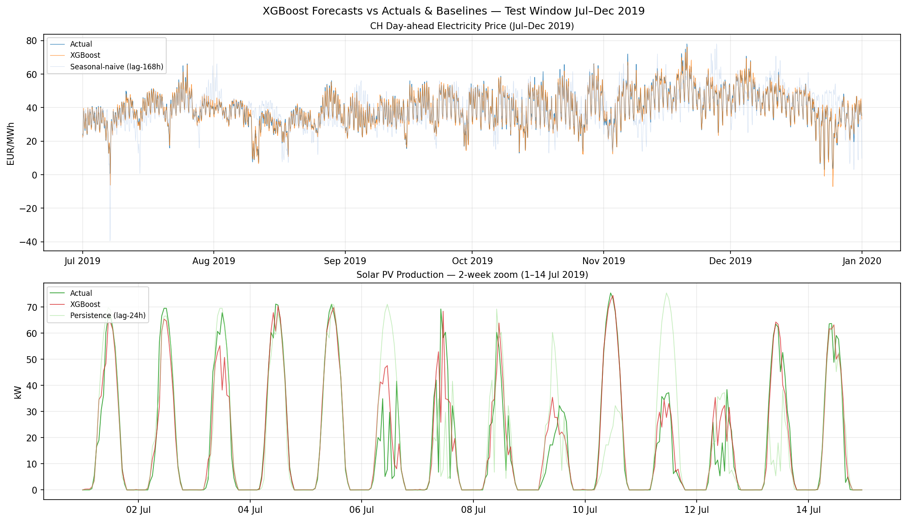

# Swiss ZEV Energy Forecaster

A complete data pipeline and AI forecasting model for Swiss commercial energy systems. It evaluates the economics of self-consumption for a modeled logistics warehouse in Baar (ZG), using real Swiss day-ahead prices, simulated PV production, and robust data engineering practices.

[**Live Dashboard Demo**]([https://swiss-zev-forecaster.streamlit.app/](https://share.streamlit.io/errors/not_found))

## Why this exists

The Swiss energy transition relies heavily on decentralised production and consumption. Under the **ZEV** (Zusammenschluss zum Eigenverbrauch) regulation, commercial properties can pool consumption to maximize **self-consumption**. This project serves as a quantitative engine to evaluate these setups: calculating autarky and self-consumption ratios, forecasting day-ahead electricity prices, and providing the underlying data foundation required for modern Energy-as-a-Service (EaaS) and energy contracting models.

## Architecture & Data Infrastructure

This project is built on a modern, scalable **ELT (Extract, Load, Transform)** analytical environment. While it currently uses DuckDB as a high-performance local analytical engine, the modular architecture is intentionally designed for a seamless migration to modern cloud data infrastructures such as BigQuery, Snowflake, Redshift, or Databricks.

- **Data Pipelines & Engineering (Python & SQL):** Automated data extraction, transformation, and loading of energy market data, weather data, and consumption profiles.
- **Data Warehousing (DuckDB / BigQuery / Snowflake):** Structured to mirror production workflows in modern cloud data warehouses, demonstrating proficiency in building purpose-driven analytical environments.
- **Transformation & Validation (dbt):** All business logic is managed in dbt SQL. This layer includes rigorous data quality and plausibility checks (e.g., verifying expected ranges for prices, handling missing values) to continuously improve analytical outputs.
- **AI-Based Forecasting (XGBoost & Machine Learning):** Applying and training AI models and machine learning algorithms (XGBoost regression) to predict day-ahead market prices and energy generation based on historical patterns.
- **Reporting & Visualisation (Streamlit):** An interactive dashboard creating KPI reports, data visualizations, and variance analysis to translate findings into actionable recommendations for stakeholders.

## Results: AI-Based Price & Energy Forecasts

The project implements two XGBoost regression models trained on 2015-2018 data, validated on H1 2019, and tested on H2 2019. 

### Day-Ahead Price Forecast (CH)

The price model strongly outperforms seasonal baselines, particularly during daytime peak hours (8:00–19:00) when solar generation and load are highest, which is crucial for identifying optimization opportunities.

| Metric | XGBoost Model | Persistence (24h) | Seasonal Naive (168h) |
| :--- | :--- | :--- | :--- |
| **Overall MAE (EUR/MWh)** | **1.34** | 5.06 | 5.91 |
| **Peak 8-19h MAE (EUR/MWh)** | **1.27** | 6.09 | 6.21 |

### PV Production Forecast

The PV model accurately captures weather effects, predicting generation based on irradiance and cloud cover data, comfortably beating the naive persistence baseline.

| Metric | XGBoost Model | Persistence (24h) |
| :--- | :--- | :--- |
| **Overall MAE (kW)** | **2.71** | 6.92 |
| **Daytime 6-20h MAE (kW)** | **4.32** | 11.08 |



**Known Model Limitations:**
- **Price Spikes:** The XGBoost model struggles with sudden, extreme market price spikes driven by geopolitical events or unexpected nuclear outages in neighboring countries, tending to under-predict the peak magnitude.
- **DST Handling:** Daylight Saving Time transitions inherently disrupt the 24h and 168h lags. The data pipeline handles this via UTC alignment and hour-averaging, but the ML model sees a slight degradation in accuracy around transition days.

## Quickstart

To run the entire data pipeline locally:

```bash
# 1. Sync dependencies
uv sync

# 2. Setup environment variables (ENTSO-E API Key required)
cp .env.example .env

# 3. Extract data to the DuckDB raw layer
make ingest

# 4. Run dbt transformations & tests
make dbt

# 5. Launch the interactive dashboard
make dashboard
```

## Data Sources & Licensing

The project relies entirely on high-quality, free data:
- **ENTSO-E Transparency Platform:** Day-ahead prices, load, and generation mix.
- **PVGIS (EU JRC):** Simulated hourly PV production data (SARAH2 database).
- **Open-Meteo:** Historical weather archive for irradiance, temperature, and cloud cover.

## Limitations & Assumptions

- **Synthesized Load Profile:** The warehouse load is synthesized using BDEW standard load profile (G1) coefficients rather than real smart-meter data.
- **Static Tariffs:** Financial KPIs are calculated using fixed default tariffs. In reality, these vary significantly by local Swiss utility (Verteilnetzbetreiber).
- **Swiss Carbon Intensity:** A flat factor of 30 gCO₂/kWh is used for the grid carbon intensity, based on SFOE averages.

## Roadmap

### ZEV Economics Expansion
As a future enhancement, this analytical infrastructure will be expanded to simulate full real-world energy contracting scenarios, analyzing energy data to identify optimization opportunities. 

By joining the forecasted PV and load profiles against Swiss typical tariffs (e.g., Retail: 28 Rp./kWh, Feed-in: 8 Rp./kWh), the project will automatically evaluate key metrics for a modeled warehouse (e.g., 100 kWp PV array and ~500 MWh/yr demand):

- **Self-Consumption Ratio:** Projected at ~82.8% 
- **Autarky Ratio:** Projected at ~17.6%
- **CO₂ Avoided:** ~2,640 kg/year
- **Financial Savings:** ~CHF 17,600/year

*This baseline model will further demonstrate how the facility absorbs almost all generated solar power directly, paving the way for advanced LEG-shared PV community simulations and dynamic energy trading integrations.*

### Technical Infrastructure
- **Cloud Migration:** Replace local DuckDB instances with **Snowflake** or **BigQuery** to leverage modern cloud data infrastructure at enterprise scale.
- **Advanced Orchestration:** Transition data pipelines to Apache Airflow for robust scheduling and dependency management.
- **Anomaly Detection:** Implement robust machine learning anomaly detection algorithms on incoming consumption and asset data to continuously improve analytical outputs.
